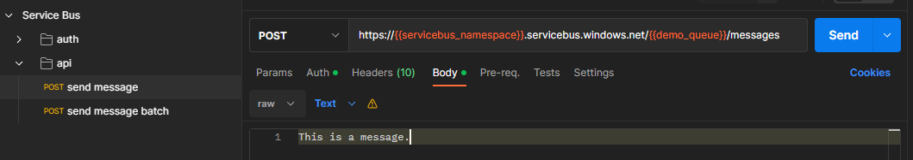
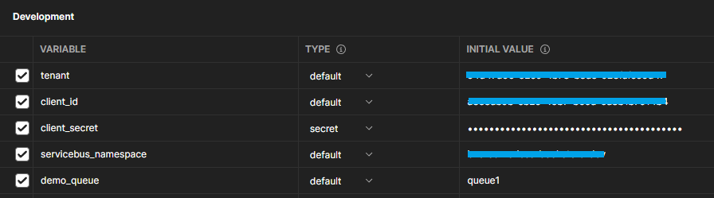
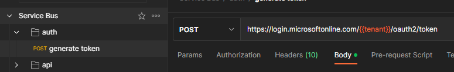
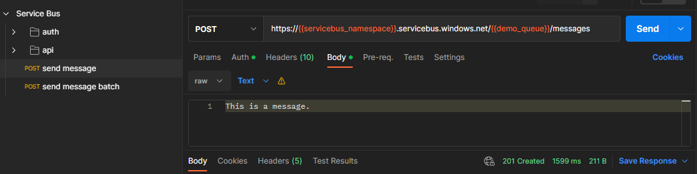

# Service Bus - Postman client

This is a Postman boilerplate collection to use **Azure Service Bus REST API** as detailed in the [official docs][1].



You'll find the Azure CLI instructions below to setup the required resources that Postman will need. You can also create the resources with the Azure Portal and just use the Postman collection.

## Setup

Steps to setup the Postman client:

1. Create an App Registration on Azure AD with a client secret + Service Principal
2. Create a Service Principal for the App Registration.
3. Assign the desired Service Bus RBAC to the Service Principal.
4. Configure the Postman collection to connect to Azure AD and Service Bus.


### 1 - Create the App Registration

```sh
# Create a new App Registration on Azure AD (ex: postman-servicebus-dev)
az ad app create --display-name "{name}" --query "appId" -o tsv

# Set the application (client) ID and create a secret (💡 save this output for later)
az ad app credential reset --append --display-name "postman" --id "{APPLICATION ID}"

# Create a Service Principal for the application
az ad sp create --id "{APP ID}" --query "id" -o tsv
```

### 2 - Assign permissions for the **Service Principal** to send messages to Service Bus

```sh
# Get the Service Bus resource id
az servicebus namespace show -n "{SERVICEBUS NAMESPACE}" -g "{RESOURCE GROUP}" --query id -o tsv

# Assign the permission
az role assignment create --assignee "{SERVICE PRINCIPAL ID}" \
  --role "Azure Service Bus Data Sender" \
  --scope "{SERVICE BUS RESOURCE ID}"
```

> ℹ️ Optionally, you can add `Azure Service Bus Data Receiver` or even `Azure Service Bus Data Owner` depending no your needs. Check out Azure RBAC [built-in roles][3].

### 3 - Configure Postman & Send messages

Download and import both the **Collection** and the **Environment** boilerplate files from this repository that are available under the [./postman](/postman/) folder.

Set the required values so Postman can authenticate and send messages. You'll add the dynamic values that were generated and your Service Bus namespace name and queues.



Select the environment on Postman. First you need to authenticate and generate a token:

> 💡The token will be automatically saved to the context in the `{{access_token}}` variable on Postman



✅ You can now send messages to Service Bus.

I've added a batch request there as well. You might want to check Service Bus [REST API][2] for more operations, options, and troubleshooting.



[1]: https://learn.microsoft.com/en-us/rest/api/servicebus/get-azure-active-directory-token
[2]: https://learn.microsoft.com/en-us/rest/api/servicebus/service-bus-runtime-rest
[3]: https://learn.microsoft.com/en-us/azure/role-based-access-control/built-in-roles
